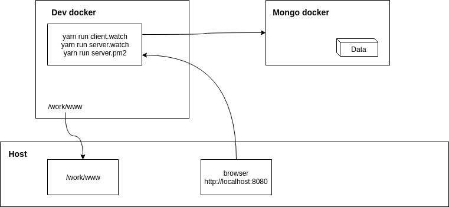

# GOLERY
A free hierarchy note online.

The service is available online at [https://www.golery.com/pencil]. 

## Technology stack
1. Front:
    - React
    - PostCss   
2. Server side
    - ExpressJs
3. Build tool:
    - Webpack
    - Yarn
4. Database: 
    - MongoDb
5. Deployment: 
    - Docker
    - Aws ECS

## Dockers for development architecture
During developments, building and running at local are in side containers.

There are 2 contains 
- Mongo DB docker container
- Dev docker container

## Development guides (more)
[Link](docs/README.md)

## License
[Link](LICENSE.txt)