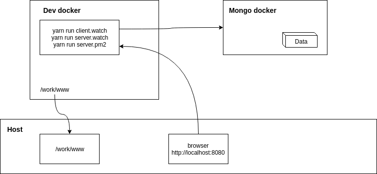

#Note
- Diagram in this folder can be edit with https://www.draw.io (open .png file directly)
#Dev
1. Docker architecture
   
2. Links
	- http://localhost:3001/goevent
3. Run
	+ cd /work/provision/docker/mongo
		- ???
	+ cd /work/provision/docker/dev
		- ./run.sh
		- ./attach.sh
			- yarn run webpack
			- yarn run server
#Renew certificate
- Login to amazon ecs
- docker exec -it container
- /softwares/golery/acme/cron-renew.sh